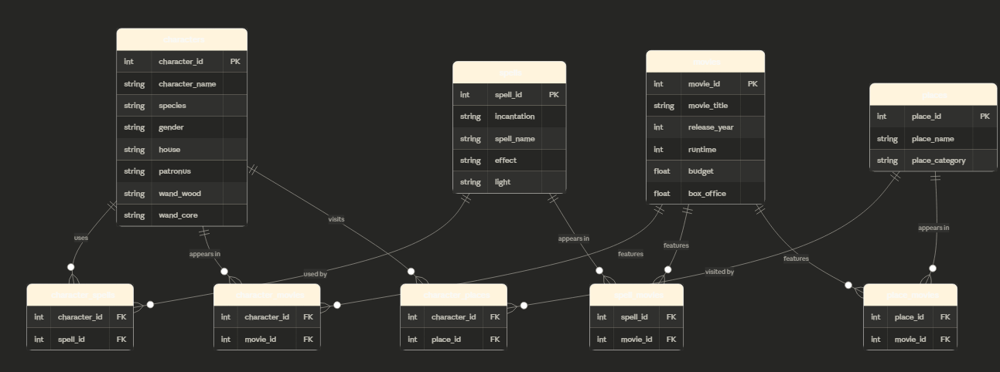

# Wizarding World Database (In Progress)

## Overviews
This project is a relational database based on the Harry Potter universe, designed to model relationships between characters, spells, movies, and places.

The goal of this project is to gain hands-on experience with database design, table creation, data modeling, and querying using SQL. Rather than focusing on perfect optimization, this project emphasizes building a complete data pipeline from schema design to analysis.

## Object
- Design a relational database schema from a real-world dataset
- Implement one-to-many and many-to-many relationships
- Create and populate junction tables
- Practice writing SQL queries to extract meaningful insights
- Build an end-to-end workflow: design → load → queryives

## Database Schema
**Core Entities:**
- Characters
- Spells
- Movies
- Places

**Relationships:**
- Characters ↔ Spells (many-to-many)
- Characters ↔ Movies (many-to-many)
- Movies ↔ Spells (many-to-many)
- Movies ↔ Places (many-to-many)
- Characters ↔ Places (many-to-many)

Junction tables are used to properly model many-to-many relationships and maintain data integrity.

## ERD

## Tech Stack
- PostgreSQL
- -SQL
- pgAdmin
- Python

## Dataset
[Harry Potter Movies Dataset](https://www.kaggle.com/datasets/maricinnamon/harry-potter-movies-dataset) via Kaggle

## Data Pipeline
1. Designed schema and relationships (ERD)
2. Created tables with primary and foreign keys
3. Populated tables using dataset
4. Built junction tables to handle many-to-many relationships
5. Wrote SQL queries to analyze relationships and patterns

## #xample Questions/Queries
- Which characters use the most spells?
- Which movies feature the most characters?
- What are the most frequently used spells?
- Which places appear in the most movies?
- How are spells distributed across movies?

See [`analysis_queries.sql`](wizarding_world_DB/queries/analysis_queries.sql) for the full query list.

## In Progress
- Expanding query set for deeper insights
- Improving query efficiency and readability
- (Optional) Considering normalization improvements in future iteration

